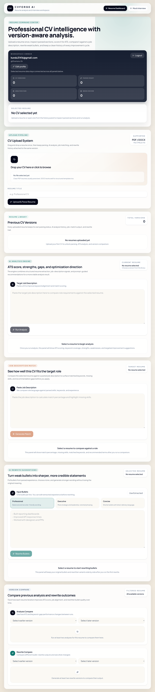
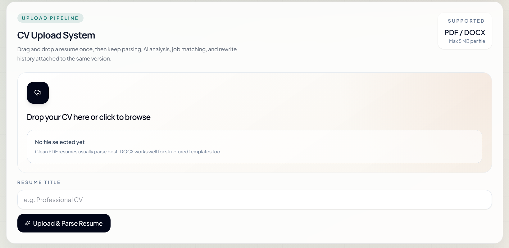
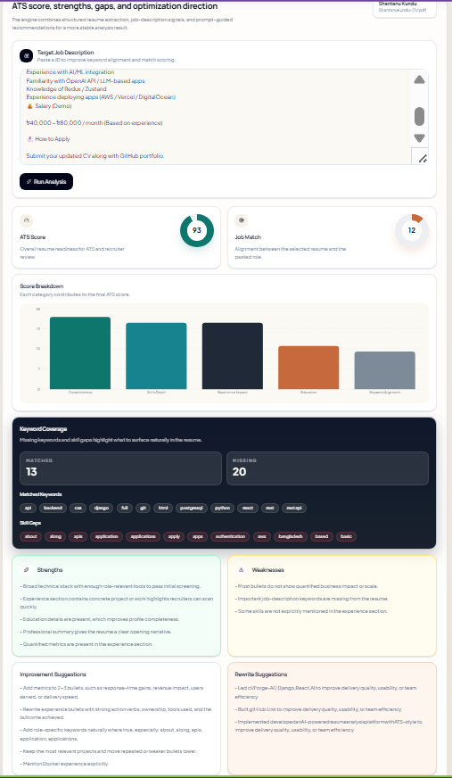
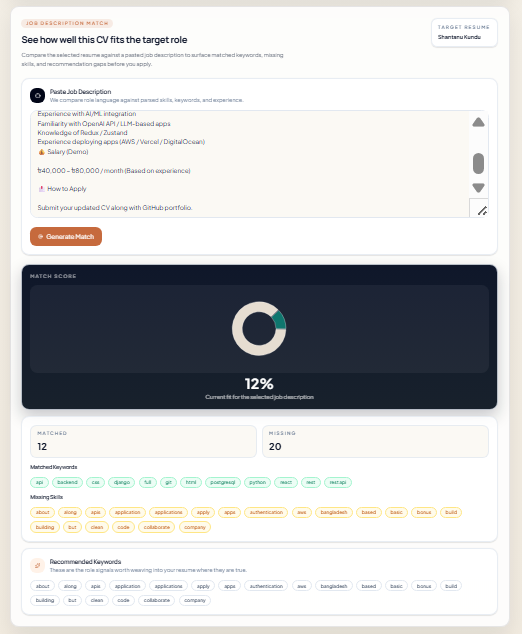
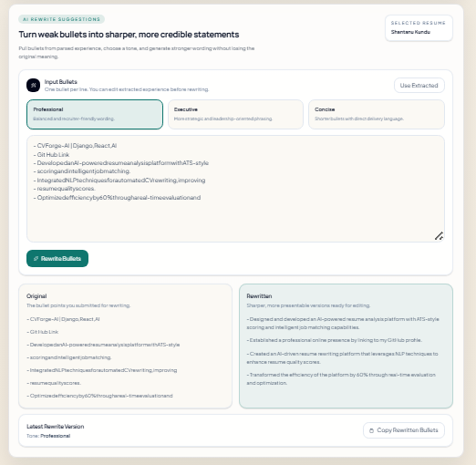
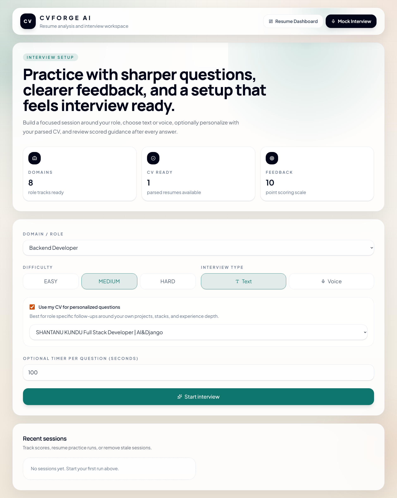

# CVForge-AI
CVForge AI is a modern, full-stack web application designed to help users analyze, optimize, and improve their resumes using AI-driven insights. Built with Django and React, it combines ATS-style evaluation, job matching, and smart rewriting into a single seamless workspace.

---

## 🧠 Key Features

### 📊 ATS Resume Analysis

* Analyze resumes with AI to identify strengths, weaknesses, and missing skills
* Get structured feedback similar to real-world ATS systems
* Visual score breakdown (ATS score, match %, skill gaps)

---

### 🎯 Job Description Matching

* Compare your CV against a target job description
* Detect missing keywords, required skills, and experience gaps
* Generate a **match score with actionable insights**

---

### ✍️ AI Bullet Rewriting

* Improve weak resume bullet points instantly
* Generate **professional, impactful, and concise statements**
* Multiple rewriting styles (Professional, Executive, Concise)

---

### 🗂️ Version Control for CVs

* Track different resume versions over time
* Compare analysis results between versions
* Maintain a history of improvements and rewrites

---

### 📂 Smart CV Upload System

* Upload resumes in **PDF / DOCX format**
* Automatic parsing and data extraction
* Structured display of skills, experience, and education

---

### 🎤 AI Mock Interview (Bonus Module)

* Practice role-based interviews (Backend, etc.)
* Choose difficulty: Easy / Medium / Hard
* Get feedback and scoring after each response

---

## 🛠️ Tech Stack

### 🔧 Backend

* Django
* Django REST Framework
* PostgreSQL

### 🎨 Frontend

* React.js
* Tailwind CSS

### 🤖 AI Integration

* Grok API (for analysis, rewriting, and matching)

---

## 📸 Screenshots

### 🏠 Dashboard & Resume Analysis



### 📂 CV Upload Pipeline



### 📊 ATS Analysis & Insights



### 🎯 Job Match System



### ✍️ AI Rewrite Suggestions



### 🎤 Mock Interview



---

## ⚙️ Installation & Setup

### 1️⃣ Clone Repository

```bash
git clone https://github.com/your-username/cvforge-ai.git
cd cvforge-ai
```

---

### 2️⃣ Backend Setup (Django)

```bash
cd backend
python -m venv venv
source venv/bin/activate   # (Linux/Mac)
venv\Scripts\activate      # (Windows)

pip install -r requirements.txt

python manage.py migrate
python manage.py runserver
```

---

### 3️⃣ Frontend Setup (React)

```bash
cd frontend
npm install
npm run dev
```

---

### 4️⃣ Environment Variables

Create a `.env` file in backend:

```env
OPENAI_API_KEY=your_api_key_here
DEBUG=True
```

---

## 🧪 How It Works

1. Upload your CV
2. System parses and extracts structured data
3. AI analyzes resume quality and ATS score
4. Paste a job description for matching
5. Get improvement suggestions and rewritten content
6. Save and compare versions

---

## 🎯 Use Cases

* Students preparing for internships/jobs
* Developers optimizing resumes for ATS systems
* Job seekers targeting specific roles
* Practicing interviews with AI feedback

---

## 🚀 Future Improvements

* Resume PDF export after rewriting
* Real-time collaboration (team review)
* Advanced analytics dashboard
* More AI interview modes (voice/video)

---

## 🤝 Contributing

Contributions are welcome. Feel free to fork the repo and submit a pull request.

---

## 📄 License

This project is licensed under the MIT License.

---

## 👨‍💻 Author

**Shantanu Kundu**
Full Stack Developer (Django + React)
Passionate about building AI-powered applications

---

⭐ If you like this project, consider giving it a star on GitHub!
